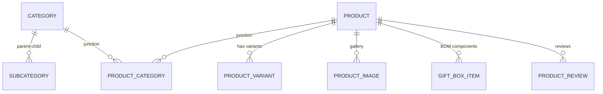

# Catalog Management & Hierarchy Architecture

## 1. Domain Entities & Relationships

## 2. Multi-Category Junction Model (`ProductCategory`)
- `ProductId` (Guid, FK)
- `CategoryId` (Guid, FK)
- `IsPrimary` (bool)
- One primary category per active product.
- Product can belong to multiple auxiliary categories (`Featured`, `Best Sellers`, `Diwali Specials`, `Combo Offers`).
- Prevent deletion of categories with active products without explicit reassignment.

## 3. Product Variants (`ProductVariant`)
- Variants allow multi-size/shot packaging under a single catalog master:
  - e.g., **Aerial Shot 60**: `30 Shots`, `60 Shots`, `120 Shots`.
- Fields: `Id`, `ProductId`, `SKU`, `Name`, `Price`, `CostPrice`, `StockQuantity`, `Barcode`, `IsActive`.
- Each variant has independent stock tracking in the inventory warehouse ledger.

## 4. Gift Boxes & Combos (BOM)
- `GiftBoxItem`: Defines component quantities (e.g., *Family Celebration Box* = 2 Sparklers + 3 Flower Pots + 5 Rockets + 5 Ground Chakkars).
- Combos feature promotional savings calculation:
  $$\text{Savings} = \text{Normal Value} - \text{Combo Price}$$
