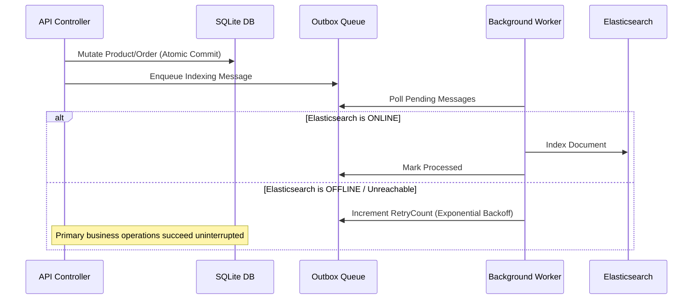

# Search Architecture & Elasticsearch Resilience

## 1. Primary Source of Truth vs Search Index
- **SQLite** is the authoritative source of truth for all business state.
- **Elasticsearch** serves as an asynchronous read accelerator and full-text indexing engine.

## 2. Fault-Tolerant Outbox Indexing

## 3. Graceful Search Fallback
- If Elasticsearch is offline, `IProductSearchService` falls back gracefully to SQLite database `LIKE` / `Contains` querying so storefront customers never experience outages.
