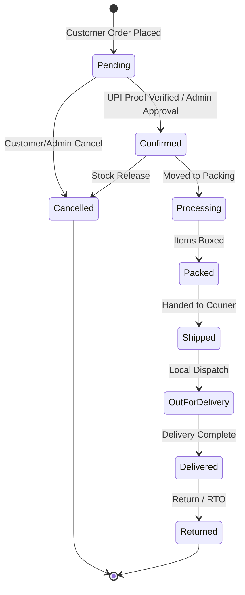

# Orders, State Machine & Fulfillment Lifecycle

## 1. Order State Machine Transitions

## 2. Validation Rules & HTTP 409 Conflict
- Illegal state transitions (e.g. `Delivered -> Pending` or `Cancelled -> Confirmed`) throw `InvalidOrderStateTransitionException`, mapped automatically to HTTP 409 Conflict.
- Server-side authoritative calculation of item prices, volume discounts, coupons, shipping, and GST taxes.

## 3. Order Creation Transaction Atomicity
- Single transaction covers:
  1. Customer upsert.
  2. Order & Order Items insertion.
  3. Stock reservation (`QuantityReserved += qty`).
  4. Stock movement entry (`StockReserved`).
  5. Coupon usage decrement.
  6. Tax Invoice issuance (`INV-YYYY-XXXXXX`).
  7. Audit Log recording.
  8. Outbox message enqueuing.
