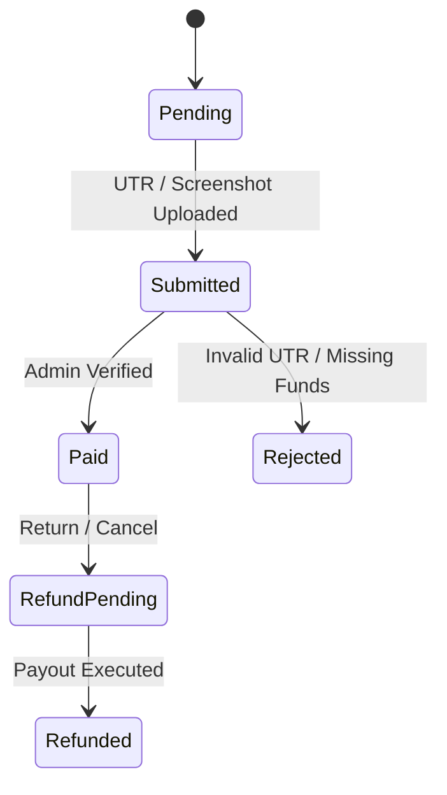

# Payment Lifecycle, UPI Verification & Idempotency

## 1. Payment Lifecycle

## 2. Supported Payment Methods
- `UPI`: Dynamic QR display + Manual UTR submission + Admin verification.
- `Cash`: Store pickup or local cash settlement.
- `NetBanking` / `CreditCard` / `DebitCard`: Gateway integration.
- `BankTransfer`: B2B wholesale RTGS/NEFT settlement.
- `COD`: Cash On Delivery.

## 3. Payment Idempotency
- All payment submission endpoints require or generate an `IdempotencyKey`.
- Repeated requests with identical keys are deduplicated without re-billing or generating duplicate financial ledger entries.
