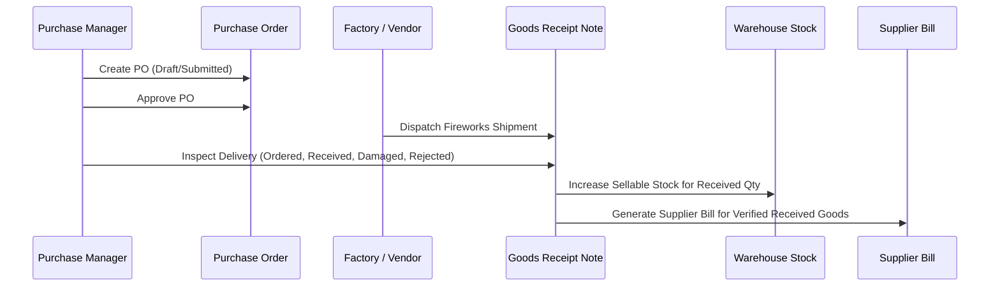

# Purchasing, Goods Receipt (GRN) & Supplier Bills

## 1. Procurement Lifecycle

## 2. Goods Receiving Inspection
- `quantityOrdered`: Original quantity requested on PO.
- `quantityReceived`: Verified sellable quantity added to `StockItem.QuantityOnHand`.
- `quantityRejected` / `quantityDamaged`: Logged in GRN with rejection reasons; excluded from sellable inventory.
- Generates `StockMovement` of type `Purchase`.
